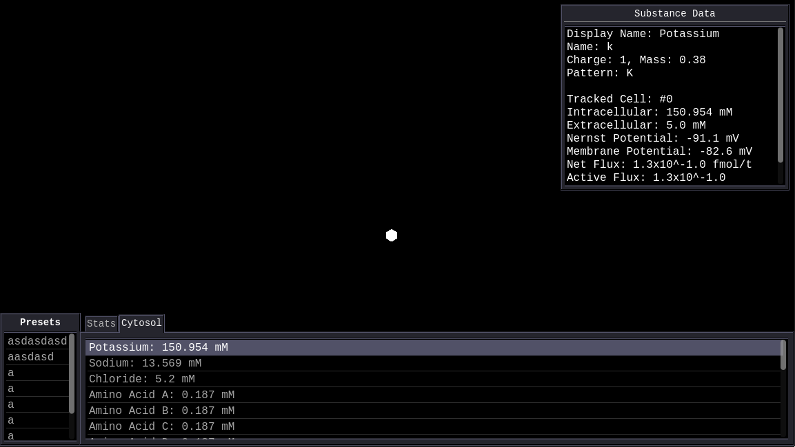

# Cellular Evolution Project
 Simple cells with simple genomes and peptides that can evolve.

## Status

**Work in progress.** The genome, peptide, chemistry, and membrane transport systems are implemented. The starter cell does not yet reach equilibrium, even if I match Sodium/Potassium pump to passive flux Chloride leaks out. I need a proper way to deal with Chloride. Since the starter cell is currently unable to reach equilibrium, cell divisions and therefore the evolution part of the project is not active yet.

## How to run

1. Install Godot 4.7.2.stable
2. Import the project from the Godot's menu and hit 'Import & Run'
3. Press Play.
4. You'll see the starter cell represented by a hexagon in the middle. Below it are the contents of its Cytosol. Clicking a substance will open a menu giving various debug information about how it currently behaves. A way to view the Genome and Proteome are yet to be implemented, you'll have to check the code for them.
## Design overview

### Cells
Cells are placed in a hexagonal grid for both simplicity and efficiency's sake. Running a physics engine is a burden to the processor, and usually requires even more burdensome soft body mechanics as rigid cell bodies aren't all that much realistic from what I have currently made.

### Substances

- **Substances** are denoted by single characters, but they also have nicknames for clarity.
- They have mass and charge, which are important in some calculations.
- They have a peptide pattern which allows peptides to specifically bind to them, more about this later.

### Genome
- There are 4 Nucleotides: a, b, c, d.
- 2 Nucleotides form 1 Codon, giving us the total of 16 amino acids all denoted by capital letters A through P.
- Nucleotides come together to form **Nucleins**.
- Nucleins are named after their sequence, though they can also be nicknamed.
- There are Protomoter and Terminator sequences on Nucleins, which encode **Peptides**.
- The next codon after the promoter is the binding site that is activated by that specific RNA Polymerase.
- There can be up to 16 specific promoter binding sites.
- A genome contains multiple nucleins but the starter cell only has 1.

### Peptides and Proteome
- Amino Acids come together to form Peptides.
- Peptides are not a subclass of Substance and their name is the sequence of amino acids they contain.
- For instance, the peptide "AICLONAA" is the starter RNA Polymerase that reads the genome and synthesises all of the starter peptides.
- Peptides have certain sequences on them that allow for specific tasks. For example, "ICLON" stands for RNA Polymerase the next two amino acids that come after that, A and A, denote the rate of transcription and which DNA binding site is used. Together, Peptides create Proteome.

### Fluids, Chemistry, and Operations
- Substances are stored in **Fluids**.
- A Chemistry stores a certain composition of Fluid and Proteome and simplifies the effects of peptides on the Fluid.
- If the Peptide or Substance composition changes, then the cell switches to a different Chemistry, allowing for easier processing.
- Chemistry does all of its operations through a class called Operations for the sake of simplicity.
- Chemistry class only deals with what peptides it can make out of a given Genome and Fluid and wheter it is applicable to current conditions
- Operation carries out what Peptides do like ion channels and polymerases.

## Membrane transport model
There is a significant attention given to ion activity with full GHK used for membrane potential
calculation and Michaelis-Menten-type substrate saturation for carrier proteins. As it stands, the
starter cell I made is unable to reach equilibrium despite weeks of work put.

## Known issues
- The starter cell does not reach equilibrium (see Status).
- The UI is pretty limited.
- There are still many debug lines existing in the code and it prints many unrelated stuff.
- The starter cell doesn't replicate yet.

## License
MIT. See [LICENSE](LICENSE).
